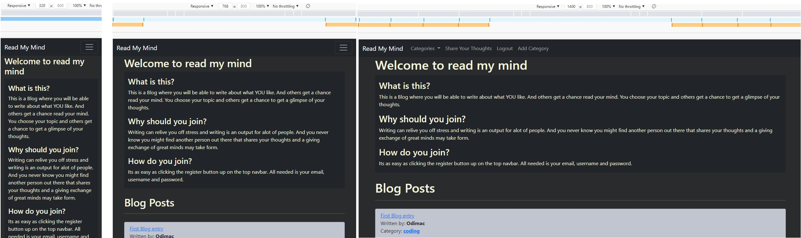

# [LINK FOR LIVE VIEW](https://project4-odimac.herokuapp.com/)

# Content

1. Introduction
2. User experience (UX)
3. Colors
4. The page
5. User stories
6. Testing
7. Deploying to github pages
8. Validation
9. Tech used
10. Credits

# Introduction
My idea starting this project was to make a Blog where anyone could share whatever they wanted, sky was supposed to be the limit. This was cause writing could be so important for some and i didnt want to limit anyone to what they could vent about.

i had my own ups and downs in life and one thing that allways helped me is writing, that have been my escape to get things off my chest and start working with it. so this project therefore fall quite close to my heart seeing that ive been there, and I been blogging to make things easier to break down.

## Wireframes from the beginning

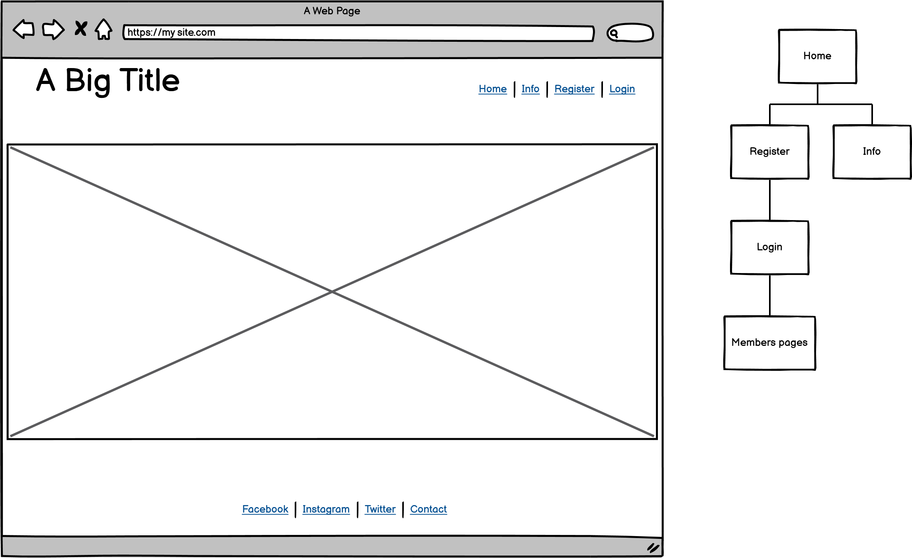
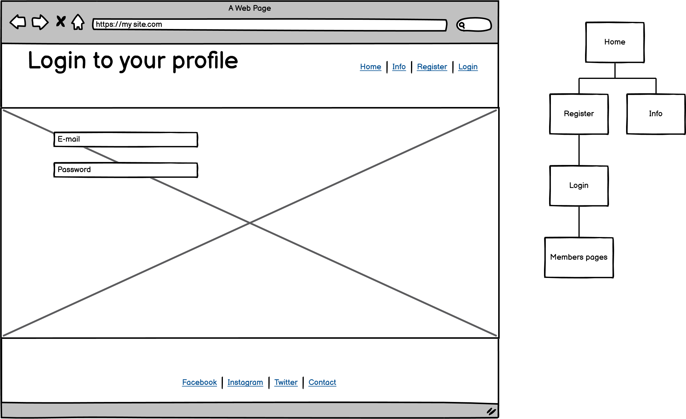
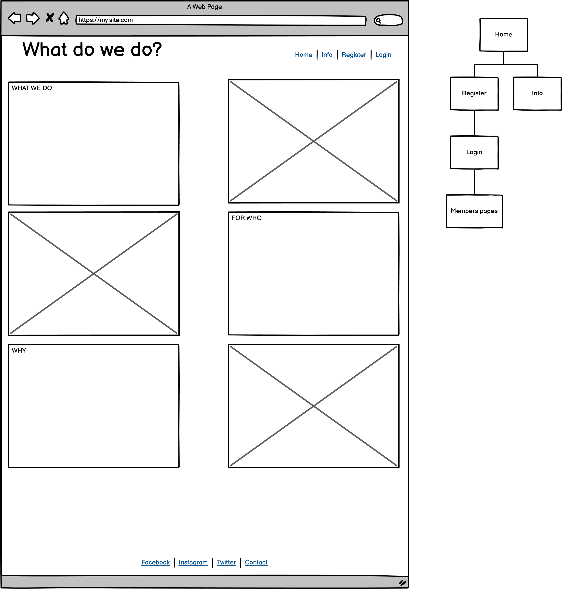
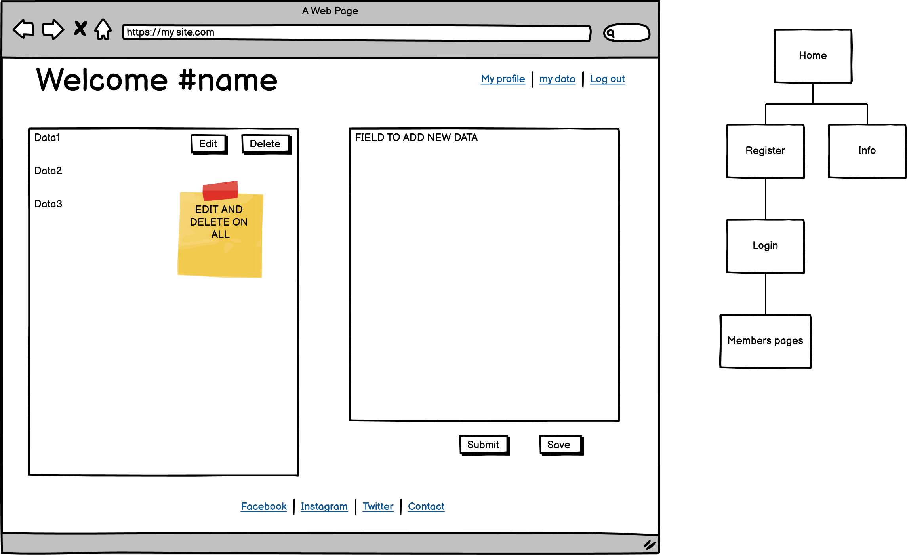
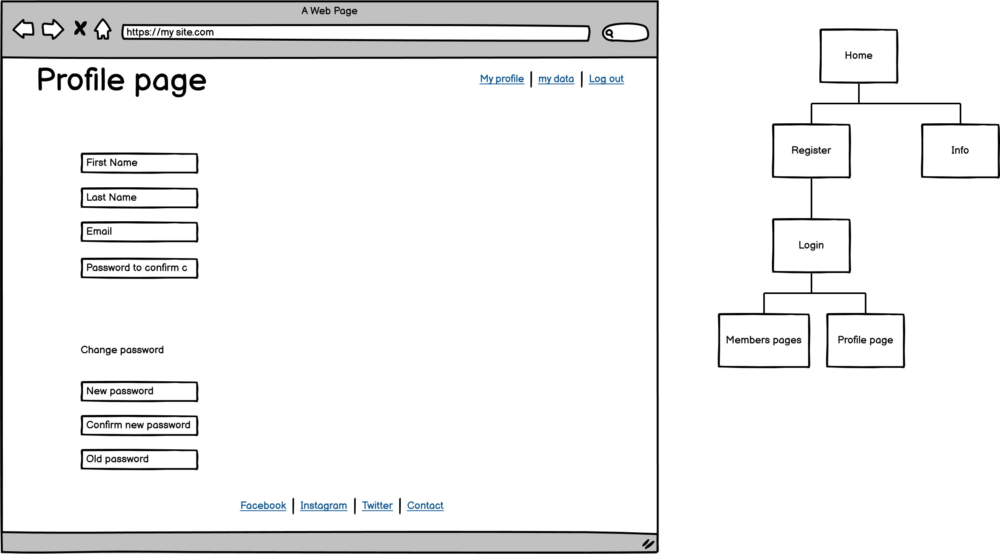
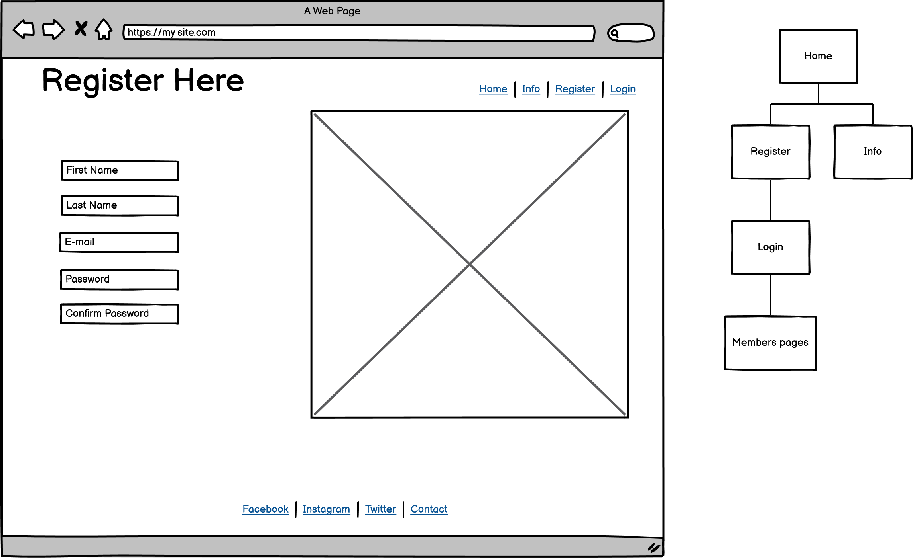

As my project progressed I both felt that i could not implement all i wanted and i also felt that alot off the things i thought about in the beginning would be a distracted and could take less space then originally intended. Also i found it that without having the opertunity to read the blogs without being a member then it would not be as easy if i want to go live for real with it and let people join it. So at the end of the day i decided to go for a diffrent design but still keep the concept of what my page was about. 

and for the members page and profile page. Those are still there in my mind to be implemented at a later date. If they will follow the looks of the wireframes are still to be seen but i do know some of the fields i want to have there for when that project can take off. 

# User experience (UX)
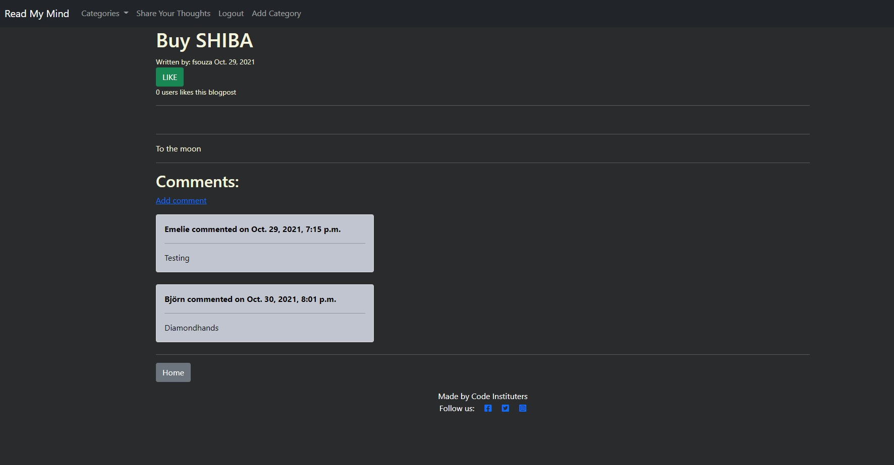
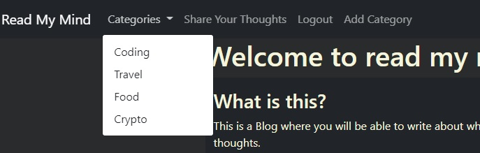
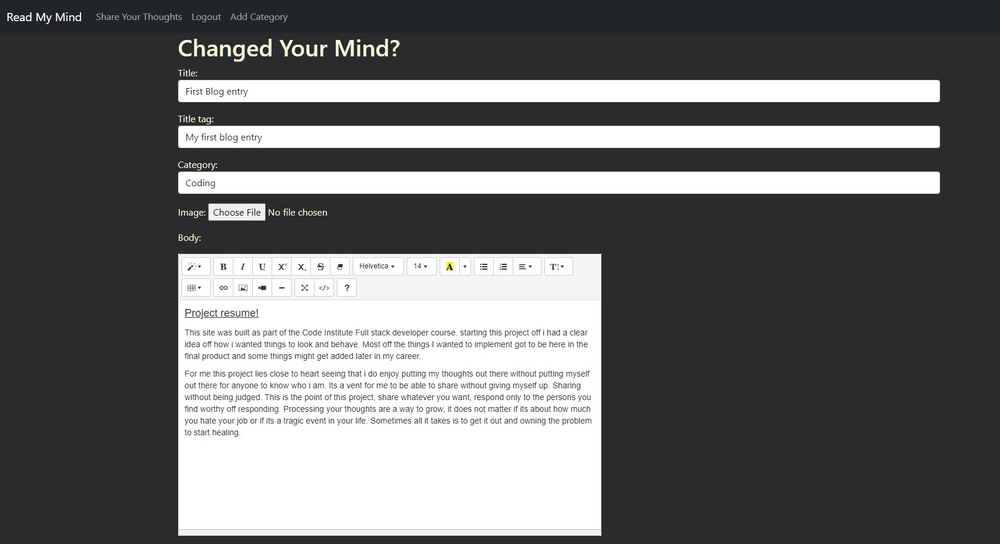
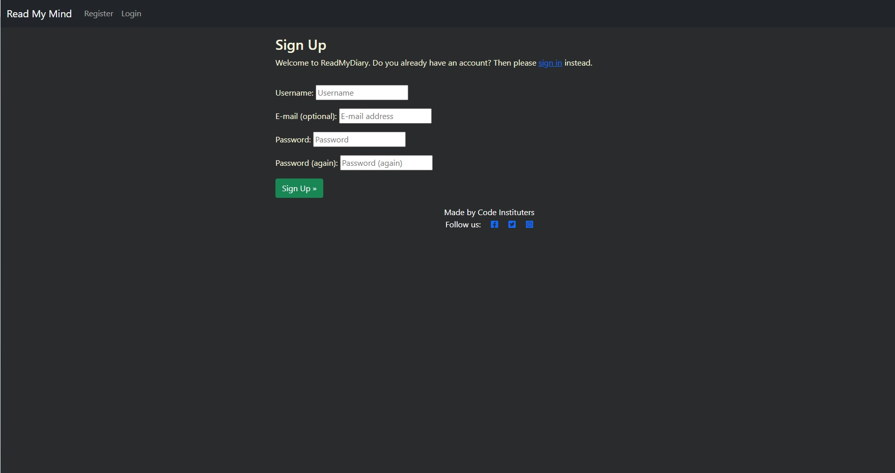
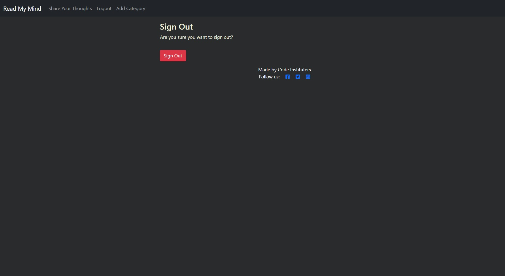

As seen in above pictures the registretion is easy and it wont take the user long to get started. the things asked for is kept to a bare minimum so that they can get going fast and at the same time it offers a great deal of privacy to the user. 

Ive also kept it open so that you can still read and comment on blog-posts without being a member so that even if you dont want to sign up you can still interact with the authors. navigating the categories can be done either by the drop down on the top navbar or by clicking the blog post category.

# Colors #

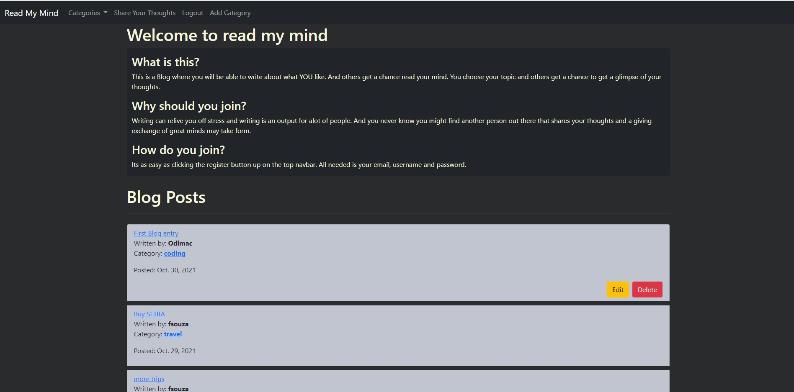
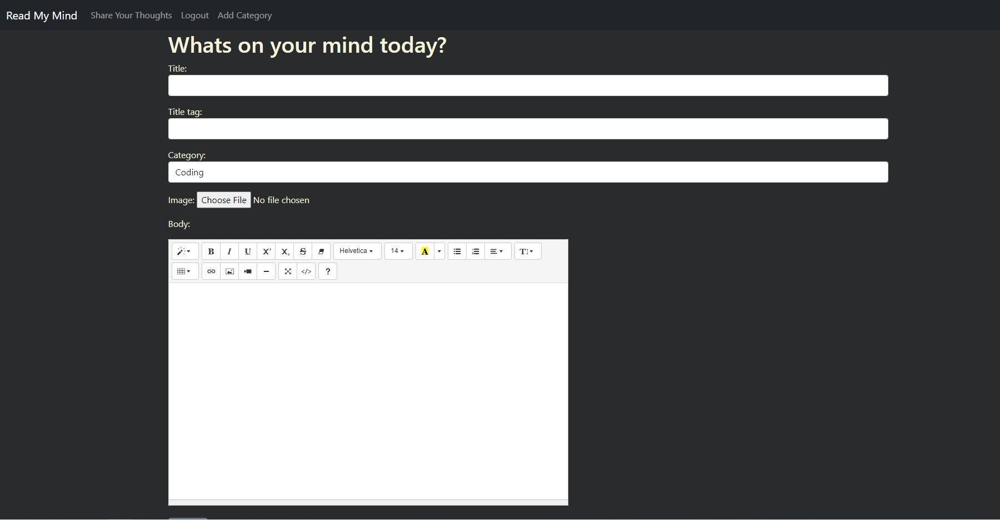

I went for a darker theme on this site since its timeless and it will make the blog posts being the starts off the show. on the main page there is a box with a slightly darker tone then the background just to mark it out just the slightest and make it look nicer sitting there with the  short text about the page.

# User stories
Me as a developer wanted to build a page where people mainly could vent out and tell their story, but still safe enough that they had the control to take that off whenever they wished. Its not always that we wish for our thoughts to be on display for the entire world to see. sometimes we want to change our mind or unread our minds. 

## User ##
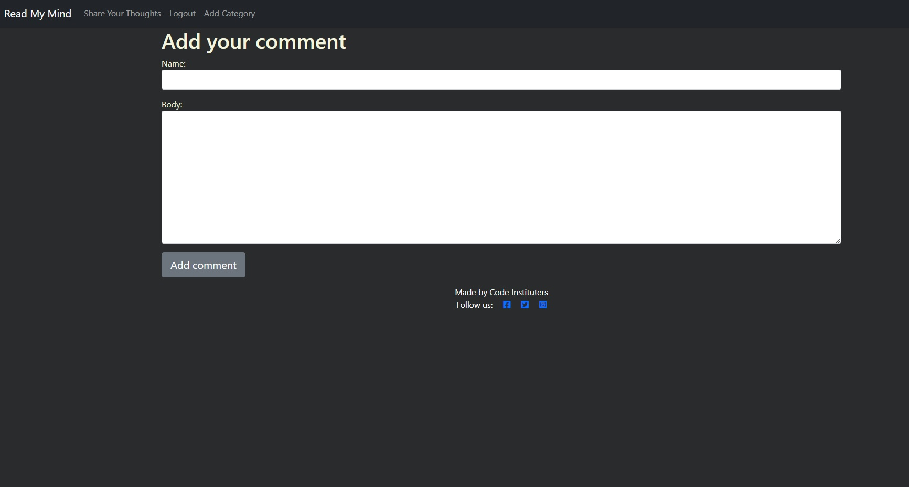
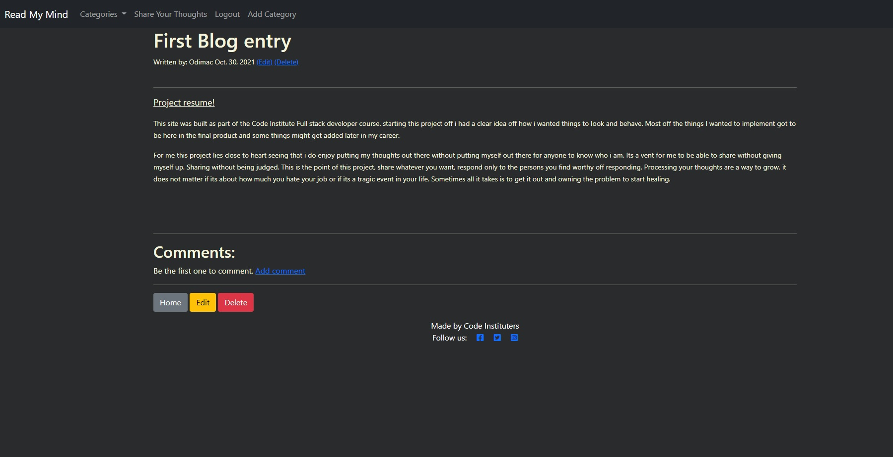
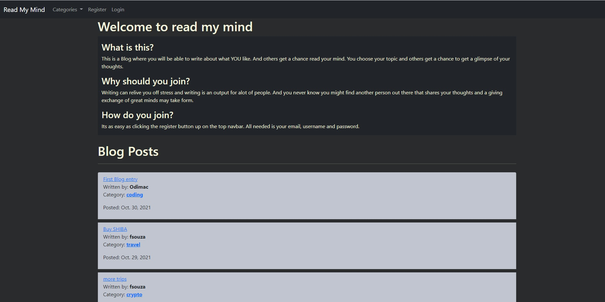
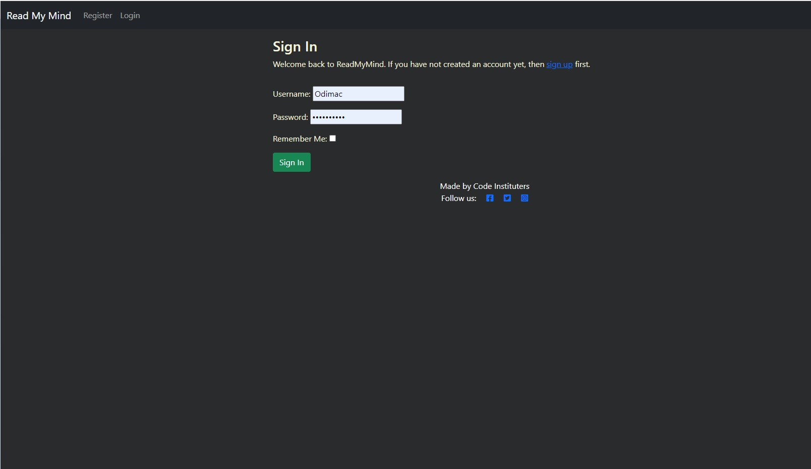

- As a user i want to be able to create a blog that is shared with others. (Implemented)
- As a User i want to be able to like a post i read. (Implemented)
- As a User i want to be able to style my blogpost. (Implemented)
- As a user i want to be able to filter the blogs in categories to read only what interests me. (Implemented)
- As a User i want to be able to add images to my blog to show what i write about. (Implemented)
- As a user i want to be able to connect by messages to other people writing. ( Not implemented)
- As a User i want to be able to comment on other peoples blogs. (Implemented)
- As a User I want to be able to add a Category to my blog to show what it is about. (Implemented)
- As a user I want to be able to edit or delete my blogs entries. (Implemented)
- As a user i want to be able to create a blog that is shared with others. (Implemented)
- As a user i want to be able to edit my profile for the blog. (Not implemented)

## Possible features to add  ##

- Message system between users
- Replies on comments
- Email verification on signup
- Profile page

# Testing

The app has been manully tested for all the functions that are implemented with success on all but one part. The only issue that still stands are that when a category is added the server needs to reboot for that category to show up as a choice in the blogpost. this has been looked at and no problem that explains this has been found in the code itself. But i have found a possible explaination in the type off Database that is being used, this seems to be a common problem within SQLlite3 which is the database type that is used by Heroku postgres app on their homepage.  follow the link for the information i found on the matter [Database limitations](https://devcenter.heroku.com/articles/sqlite3#disk-backed-storage). This could possibly be solved using a payed option instead but that has not been done and tested. 

Exept from that all Bugs have been worked out and i have not been able to get a bug to appear during the testing of the project.

The most major bugs that i had to deal with during this project includes the following.

- Signup page threw a 500 error on creating a user. This was fixed by adding ACCOUNT_EMAIL_VERIFICATION = 'none' in settings so that no verification on emaiol was required.

- Summernote fields on the blogpost entry wasent showing up as intended. This was tricky but simple when i got around it i just had to add the widget for it since my forms was already in widgets. 

Exept from this testing i have also run the page through both lighthouse and GTmetrix and the results are shown below. 

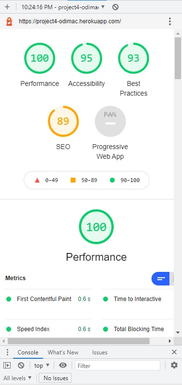

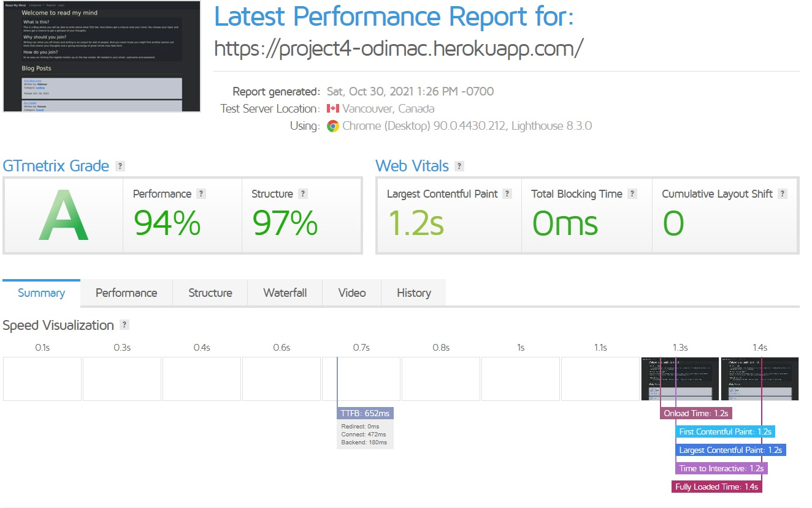

## Further testing 

When the page was seployed i went through all off the pages and tried all the functions and after the bugs had been fixed everything is in order exept from the issue with the category add function. i still left it on the site since if i would choose to work on this project after my time at CI this is a function that i want to have there and also i will add this to a payed Database and that function should work. 

Both CSS and HTML has been tested so that it works and does what it is intended to do. The jigsaw showed no errors in the CSS and the HTML validator showed no major errors within the HTML at the time of testing. 

# Validation
 

### Links to validation images ###

- [pep8 first picture](assets/images/pep8num1.jpg)
- [pep8 second picture](assets/images/pep8num2.jpg)

# Tech used

The site is built using HTML5 and CSS3 and apart from that I have got certain elements from other sources that will be mentioned below.

- [GitHub](https://www.github.com)
Hold the respiratory for this project along with files.
    
- [Gitpod](https://www.gitpod.io)
the platform ive been deploying my code on.
    
- [FontAwesome](https://fontawesome.com)
for the socialmedia icons
     
    
- [PEP8 Validation](http://pep8online.com/)
CSS jigsaw validator.
    
- [Heroku](https://heroku.com/)
For deployment of the site and application
        

# Credit

Credit goes out to the slack community for helping out when needed with pointers or just cheering me on. Especially thanks to Daisy_mentor for helping me in times off need. All those calls and your eagly eyes with expirience helped me when i got stuck.

Special thanks to Felipe Souza Alarcon aswell to find the time to respond to my questions and giving me tips and pointers where needed.